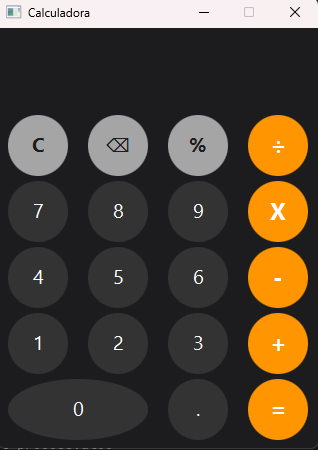

# Calculadora JavaFX

Calculadora simples de desktop desenvolvida em Java com JavaFX e Scene Builder.

## Funcionalidades

- Operações básicas: soma, subtração, multiplicação e divisão
- Porcentagem
- Limpar (C) e apagar último dígito (⌫)
- Interface construída visualmente no Scene Builder

## Tecnologias

- Java 21
- JavaFX 21
- Maven
- Scene Builder

## Como executar

### Opção 1 — Executável (recomendado)
Baixe o `.jar` na aba [Releases](../../releases) deste repositório e rode:

\`\`\`
java -jar calculadora-javafx-1.0-SNAPSHOT.jar
\`\`\`

> Requer Java 21 ou superior instalado.

### Opção 2 — Rodando via Maven
\`\`\`
git clone <url-do-repositorio>
cd calculadora-javafx
./mvnw clean javafx:run
\`\`\`

## Capturas de tela

